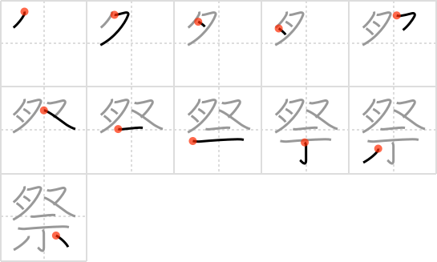

kanjivg2png
===========

This Ruby script takes stroke order data from the [KanjiVG](http://kanjivg.tagaini.net/) project and outputs PNG files in a grid format:

Usage
-----

    $ ruby kanjivg2svg.rb path/to/kanji path/to/pngfolder [frames|animated|numbers]

You can change the output type by setting the third argument. If not set it will default to PNG 'frames'. The animated and numbers are in SVG format like the original script and less perfected compared to the frames output.

License
-------

By Kim Ahlström <kim.ahlstrom@gmail.com>

[Creative Commons Attribution-Share Alike 3.0](http://creativecommons.org/licenses/by-sa/3.0/)

KanjiVG
-------

KanjiVG is copyright (c) 2009/2010 Ulrich Apel and released under the Creative Commons Attribution-Share Alike 3.0
